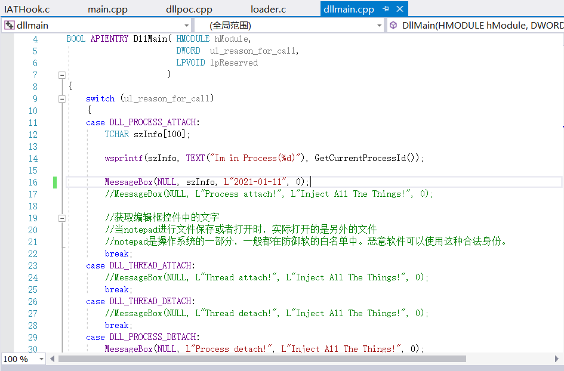

# dll注入实验报告

## 实验基础

### DllMain函数

- 功能：Windows在加载DLL的时候，需要一个入口函数。根据编写规范，Windows必须查找并执行DLL里的DllMain函数作为加载DLL的依据，它使得DLL得以保留在内存里。

- 函数头定义：
    ```C
    BOOL APIENTRY DllMain( HANDLE hModule, WORD ul_reason_for_call, LPVOID lpReserved )
    ```

    - `APIENTRY`被定义为`__stdcall`，意味着这个函数以标准`Pascal`的方式进行调用，也就是`WINAPI`方式

    - 参数`hModule`是进程中的每个DLL模块被全局唯一的32字节的HINSTANCE句柄标识(句柄代表了DLL模块在进程虚拟空间中的起始地址，只有在特定的进程内部有效)。

    - 参数`ul_reason_for_call`指明了被调用的原因。共有4种，即`PROCESS_ATTACH`、`PROCESS_DETACH`、`THREAD_ATTACH`和`THREAD_DETACH`，以`switch`语句列出。

- 调用方式：

    - DLL被加载
    - DLL被卸载
    - 单个线程启动
    - 单个线程终止


### [injectAllTheThings](https://github.com/fdiskyou/injectAllTheThings)

```C
Usage: injectAllTheThings.exe -t <option> <process name> <full/path/to/dll>
Options:
  1     DLL injection via CreateRemoteThread()
  2     DLL injection via NtCreateThreadEx()
  3     DLL injection via QueueUserAPC()
  4     DLL injection via SetWindowsHookEx()
  5     DLL injection via RtlCreateUserThread()
  6     DLL injection via Code Cave SetThreadContext()
  7     Reflective DLL injection
```


## 实验过程

- 修改dllmain.cpp文件中的DllMain函数

    

- 修改dllpoc.cpp文件中的导出函数

    

- 创建新项目DllLoader，创建loader.c文件

    

- 将项目生成，执行DllLoader.exe文件，执行成功

    

- 执行以下命令，显示注入成功。DLL被加载和卸载时都跳出提示框。

    ```C
    injectAllTheThings.exe -t <option> <process name> <full/path/to/dll>
    ```

    

    