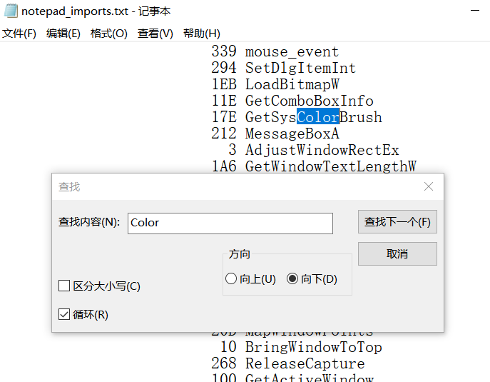
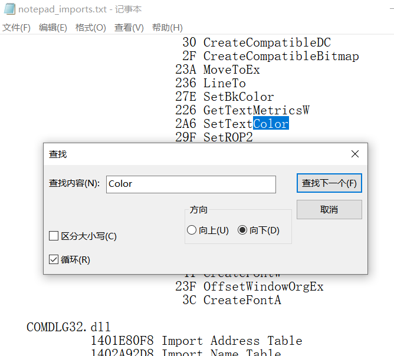

# WinDbg实验报告

## 实验目的
- 通过WinDbg篡改notepad++的文字颜色

## 实验过程

### WinDbg基础操作学习

- `bp`:在指定的地址设置断点。
- `g`:启动记事本运行。
- `db`:查看某一内存中的值。
- `lm`:查看所有的模块以及模块信息。
- `r`:显示和修改寄存器上的值。

    

    

### 篡改notepad++文字颜色

- 打开VS开发人员命令提示符

    ```bash
    cd C:\Program Files\Notepad++
    dumpbin /imports .\notepad++.exe > D:\notepad++imports.txt
    ```

- 从[导出表](https://github.com/shiancuc/Reverse-engineering/blob/main/%E6%9C%9F%E6%9C%AB%E5%A4%A7%E4%BD%9C%E4%B8%9A/windbg/notepad%2B%2Bimports.txt)中查找Color函数

    

    

    

- 对照函数文档找出`SetTextColor`是篡改文字颜色的函数

- 打开WinDbg Preview添加进程：`文件-->Attach to process`，选择`notepad++.exe`

    

- 对文字颜色进行篡改

    ```bash
    bp gdi32!SetTextColor
    #rdx存放函数的第二个参数
    bp gdi32!SetTextColor "r rdx = FFD700;g"
    #第一次执行时间很长
    ```

- 篡改成功
    

## 实验问题

- 实验最后使用WinDbg Preview，因为Win10和WinDbg的兼容性不太好

- 一开始使用命令`bp gdi32!SetTextColor "eb [rdx] FFD700;g"`报错

    

    - 因为64位环境下，会为每个参数保留一个`stack`空间，以便回写`caller`