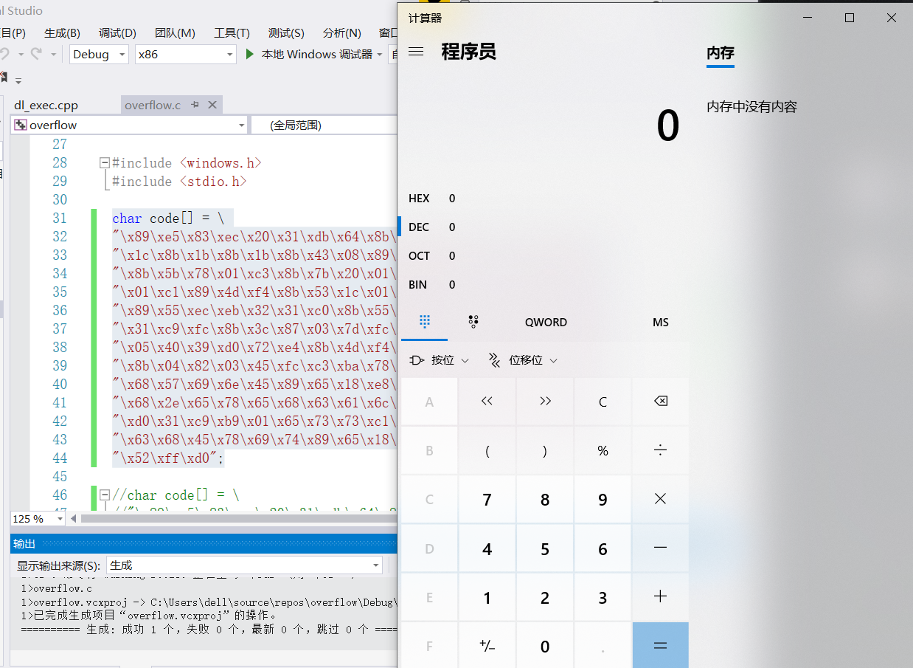
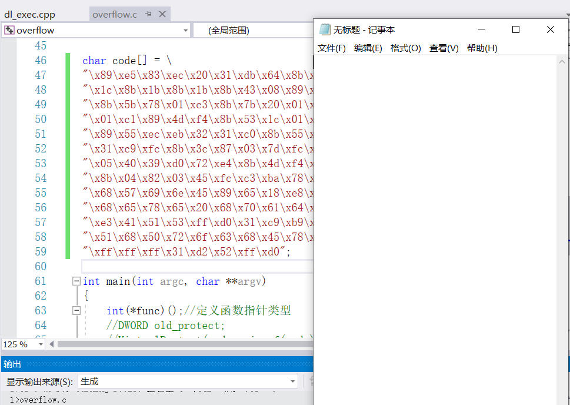
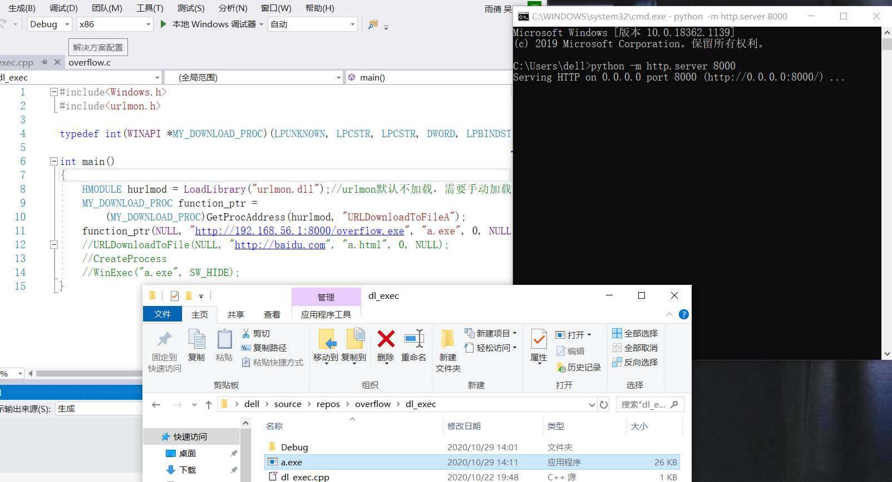
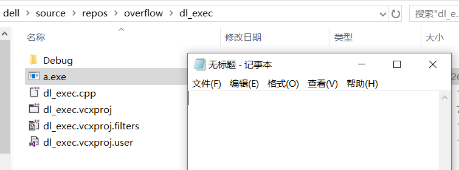

# 第八周实验报告

## 实验要求
1. 把```https://www.exploit-db.com/shellcodes/48116```这个链接中shellcode能够成功运行
2. 能从汇编源码编译通过并成功dump
3. 自行查阅资料，搜索Windows PEB结构体，PE文件导入表导出表相关数据结构的文档，解读shellcode原理
4. 修改shellcode功能为运行记事本程序notepad. exe
5. (选做，难度较大)修改shellcode功能为下载执行器，即下下载一个可执行文件，然后再运行（提示，使用原生API UrlDownloadToFileA）

## 实验过程

#### 把```https://www.exploit-db.com/shellcodes/48116```这个链接中shellcode能够成功运行

[calc代码](https://github.com/shiancuc/Reverse-engineering/blob/main/%E7%AC%AC%E5%85%AB%E5%91%A8%E5%AE%9E%E9%AA%8C/calcexec.c)



#### 修改shellcode功能为运行记事本程序notepad. exe

- 将shellcode代码中的```calc.exe```改成```notepad.exe```，再用linux系统重新编译得到```code```

[notepad代码](https://github.com/shiancuc/Reverse-engineering/blob/main/%E7%AC%AC%E5%85%AB%E5%91%A8%E5%AE%9E%E9%AA%8C/notepadexec.c)



#### 改shellcode功能为下载执行器，即下下载一个可执行文件，然后再运行

[download代码](https://github.com/shiancuc/Reverse-engineering/blob/main/%E7%AC%AC%E5%85%AB%E5%91%A8%E5%AE%9E%E9%AA%8C/dl_exec.cpp)





## 遇到的问题

- 在调试计算器执行的时候，数据执行保护已经关闭，但还是提示没有办法类型强制转换，应该把```.cpp```的文件名改成```.c```

- 在调试下载执行器的时候，防火墙会将生成的```.exe```文件杀掉，需要将防火墙完全关闭才能执行